# Introduction

Basic project information.

* **Project:** SERVICE PROVIDERS
* **GitHub Repository:** [LINK](https://github.com/ICEI-PUC-Minas-PPLCC-TI/ti1-g-prestadores-de-servico)
* **Team Members:**

  * [Henrique Pimenta Krueger](https://github.com/HenriquePkrueger)
  * [Rhayner Moura Martins da Silva Araújo](https://github.com/rhaynermartins)
  * [Samuel Vitor Vieira](https://github.com/svsamuel1912)
  * [Samuel Elias Santos Oliveira](https://github.com/SamuelMonstewe)
  * [Gabriel Ulhoa Thebaldi](https://github.com/gauthzera)

The project documentation is structured as follows:

1. Introduction
2. Context
3. Product Discovery
4. Product Design
5. Methodology
6. Solution
7. Bibliographic References

✅ [Design Thinking Documentation (MIRO)](files/processo-dt.pdf)

# Context

Details about the problem space, project objectives, justification, and target audience.

## Problem

In the information age society, where professionals are becoming increasingly specialized in specific areas of knowledge and time has become an extremely valuable commodity, some everyday tasks that were once considered trivial are becoming challenging.

A clear example of this scenario is the management of home repairs. It is not uncommon to hear reports of people who are unable to schedule, for example, plumbing or electrical repairs around a full-time work schedule.

These issues are not limited to scheduling difficulties, but also include the challenge of finding a suitable professional, checking whether they have good references, or even determining what would be a fair price for each service.

Therefore, it is natural to turn to information-age tools to address this problem.

## Objectives

The purpose of this application is to address the problem of managing home repairs by connecting consumer demand for services with income opportunities for service providers. All of this while providing convenience and security for both parties.

The solution takes the form of an application that operates on two main fronts: time and expertise.
    • Time: the app allows consumers to schedule services outside regular business hours, fitting them better into their routines, while also giving service providers the opportunity to increase their income.
    • Expertise: in addition to connecting consumers and service providers, the application provides relevant information for more informed decisions, such as reviews, portfolios, and quotes.

## Justification

Almost everyone has experienced, or knows someone who has experienced, situations involving home repairs. To better understand the problem, the main demands, pain points, and desired solutions were organized and analyzed.

Based on research with consumers and service providers, a significant demand for repairs outside regular business hours was confirmed, as well as the availability of professionals interested in meeting this demand.

Three points proved to be central:
    1. Difficulty finding qualified service providers → the first major aspect to be addressed, by connecting the parties and providing useful information such as reviews, portfolios, and quotes.
    2. Speed and proximity → a priority for users, who seek agility in service delivery. In this sense, intelligent filters allow them to choose according to their needs and location.
    3. Other recurring pain points → upfront quotes to ensure fair pricing, a reputation system to strengthen user trust, and even additional filters, such as gender, to provide greater security for consumers and service providers.

## Target Audience

The target audience can be represented by three main personas:

    1. Service provider: self-employed professionals who want to generate additional income or expand their customer base. They usually acquire clients through referrals or contacts from permanent jobs. With the app, they will be able to select jobs more conveniently according to personal criteria, representing a significant benefit.

    2. Consumer without time: people who, due to busy routines, cannot handle home repairs during regular business hours. Their main pain points are the difficulty of finding reliable professionals, the lack of clarity regarding fair prices, and insecurity during the hiring process. The app helps by providing filters that allow users to quickly find service providers without giving up essential information such as quotes and reviews.
    
    3. Consumer without expertise: individuals who have time available but lack the skills to perform repairs, even simple ones. For this audience, the application adds value by providing professional details, upfront quotes, and even additional filters, such as gender, reinforcing trust in the hiring process.

# Product Discovery

## Understanding Stage
##### Stakeholder Map 
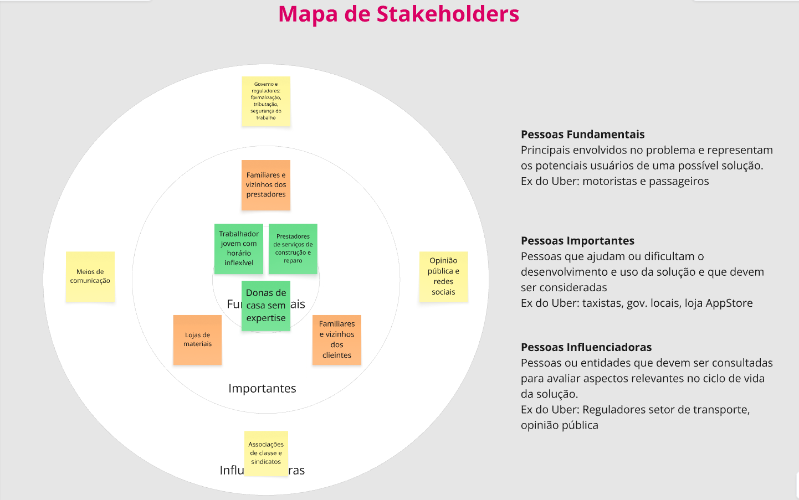
##### Stakeholder Map 
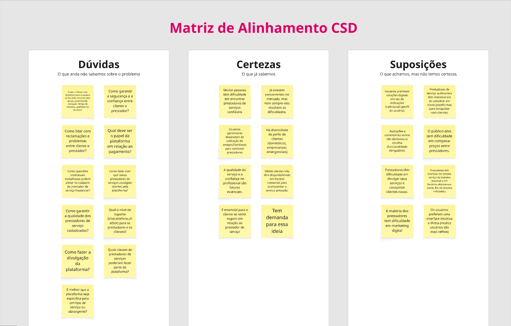

## Definition Stage

### Personas

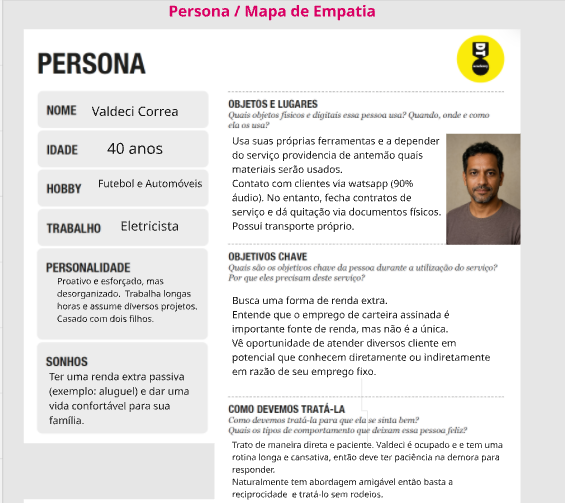
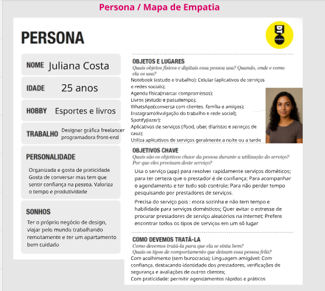
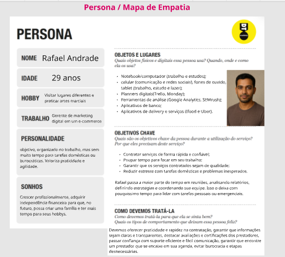
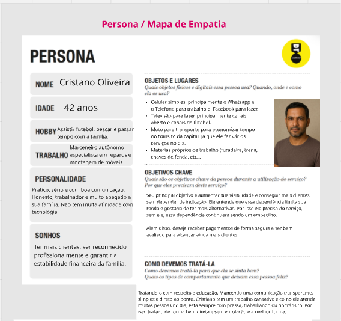  

# Product Design

At this stage, we will transform the insights and validations obtained into tangible and usable solutions. This phase involves defining a value proposition, prioritizing each idea, and subsequently creating wireframes, mockups, and high-fidelity prototypes that detail the interface and user experience.

## User Stories

Based on the analysis of the personas, the following user stories were identified:

| AS A...`PERSONA` | I WANT/NEED ...`FUNCTIONALITY`        | SO THAT ...`REASON/VALUE`               |
| --------------------- | ------------------------------------------ | -------------------------------------- |
| Electrician  | I need a schedule so that I can organize myself | because I need to find a client who best fits my profile (location and project).             |
| E-commerce Manager         | I need a feature that shows trusted professionals and someone who can solve my problem outside regular business hours | So that I can receive a service outside regular business hours from a trusted professional |
| Freelance Programmer | I need a feature that shows service providers with good reputations, since I am a woman and live alone | because I want to find a trusted professional, or at least one with a good reputation, in one place to provide service quickly outside regular business hours.|
| Carpenter| I need a feature on the platform that increases the visibility of my service to customers | To find potential customers who need my services but cannot find professionals who provide services outside regular business hours |

## Value Proposition

##### Value proposition for Valdeci

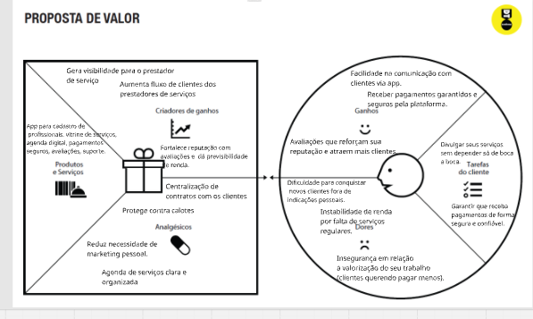

##### Value proposition for Juliana

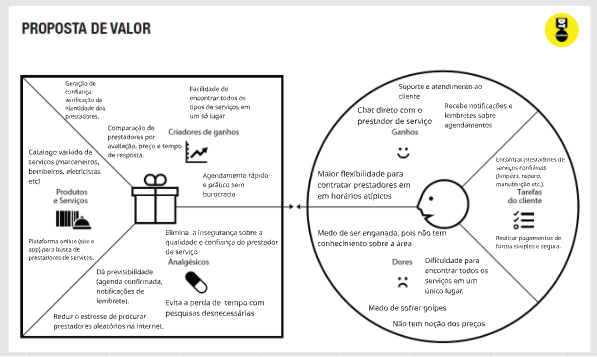

##### Value proposition for Rafael

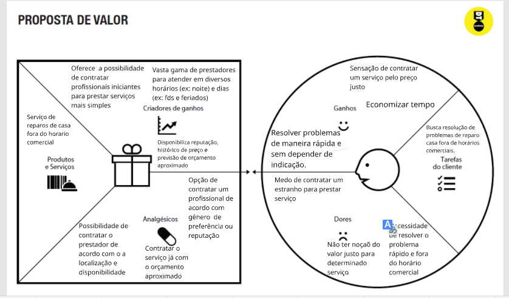
## Requirements

The following tables present the functional and non-functional requirements that define the project's scope.

### Functional Requirements

| ID     | Requirement Description                                   | Priority |
| ------ | ---------------------------------------------------------- | ---------- |
| RF-001 |User registration: the system must allow service providers to register, storing their name, email, phone number, area of expertise, where they live (they need to provide this information for the proximity filter), and whether they work outside regular business hours (the area of expertise will be a selection field).| HIGH |
| RF-002 | The system must have an area with a schedule where the service provider can add/view their scheduled services. Use the JS FullCalendar plugin for this. This page is necessary so that we can filter available time slots.| HIGH     |
| RF-003 | Search and filtering: the system must allow customers to search by service type (plumbing, furniture repairs, etc.) and filter by location| MEDIUM     |
| RF-004 | The system must have a filter to search for service providers within a given time interval (this requirement depends on RF-002)| MEDIUM     |
| RF-005 | The service provider must be able to manage their schedule flexibly, allowing them to enter available times for extra services, such as side jobs on weekends or after work.| HIGH     |
| RF-006 | The system must have an area that displays available service providers sorted by rating| MEDIUM     |
| RF-007 | Service request: the customer can send a request describing the problem and their available times.| LOW |
| RF-008 | Notifications: the system must notify the service provider and the customer when there is a new request, confirmation, or message.| LOW |
| RF-009 | The system must provide a search mechanism that allows customers to find professionals by proximity and service type, similar to how they already do it on Google.| MEDIUM |
| RF-010 | The system must provide the option 
| RF-011 | Negotiation and scheduling: the service provider and customer must be able to accept or reject requests and arrange the time directly through the system.| LOW |
| RF-012 | The software must have a feature that minimizes no-shows and delays, perhaps through a confirmation and reminder system for both parties.| LOW |

### Non-Functional Requirements

| ID      | Requirement Description                                                              | Priority |
| ------- | ------------------------------------------------------------------------------------- | ---------- |
| RNF-001 | Responsiveness: the software must be responsive, allowing use on mobile phones, tablets, and computers.| HIGH |
| RNF-002 | Technology: the front-end must be implemented using HTML, CSS, and JavaScript.| HIGH |
| RNF-003 | Technology: the code must be modular, well-commented, and version-controlled, facilitating corrections.| HIGH |
| RNF-004 | Availability: the system must be available 24 hours a day, 7 days a week.| LOW |
| RNF-005 | Usability: the interface must be intuitive, with simple navigation, clear text, and colors that facilitate reading.| LOW |
| RNF-006 | Access: the system must be made available through the HTTPS protocol, ensuring secure user navigation.| LOW |

## Interface Design

Artifacts related to the interface and user interaction in the proposed solution.

### Wireframes

These are the system's screen prototypes.

##### Service Provider Registration Screen

On this screen, service providers will be able to register their profile on the platform.

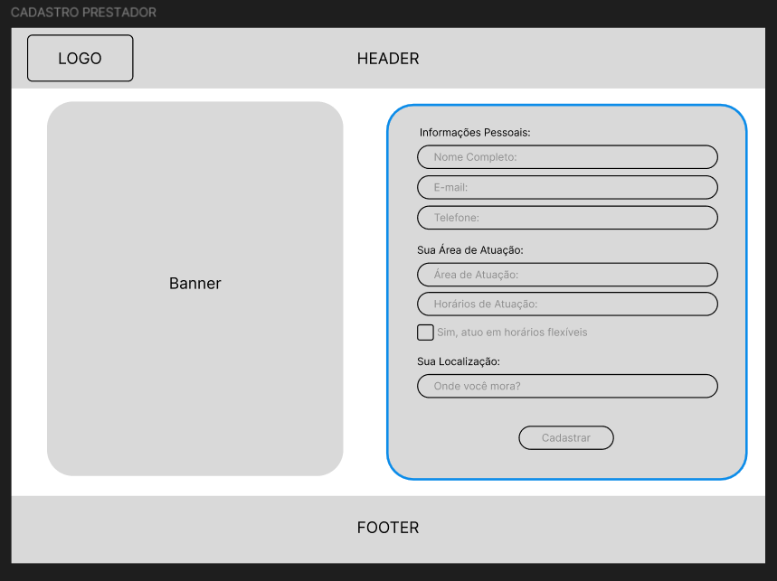

##### Landing Page
This screen represents the website's main page.

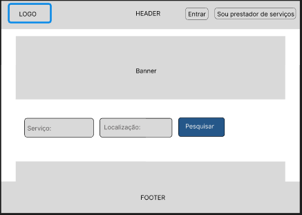

##### Service Provider View Screen
On this screen, users will be able to view the service provider and request a service from them.

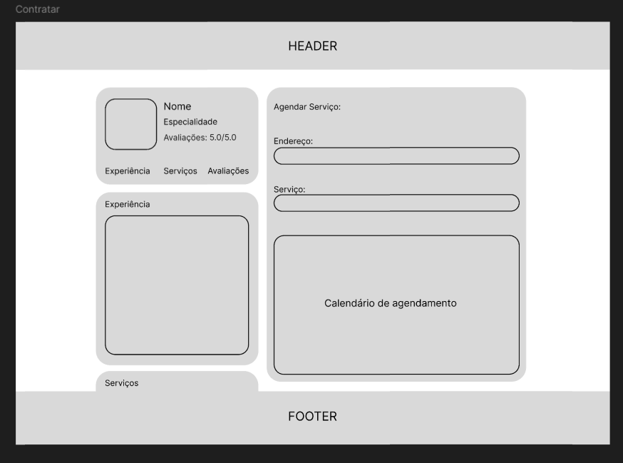

##### General Registration Screen
This screen is for a general registration page on the website, allowing users to register either as a service provider or as a regular user.

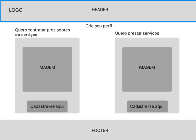

##### Regular User Registration Screen
This screen is for a regular user to register on the platform.

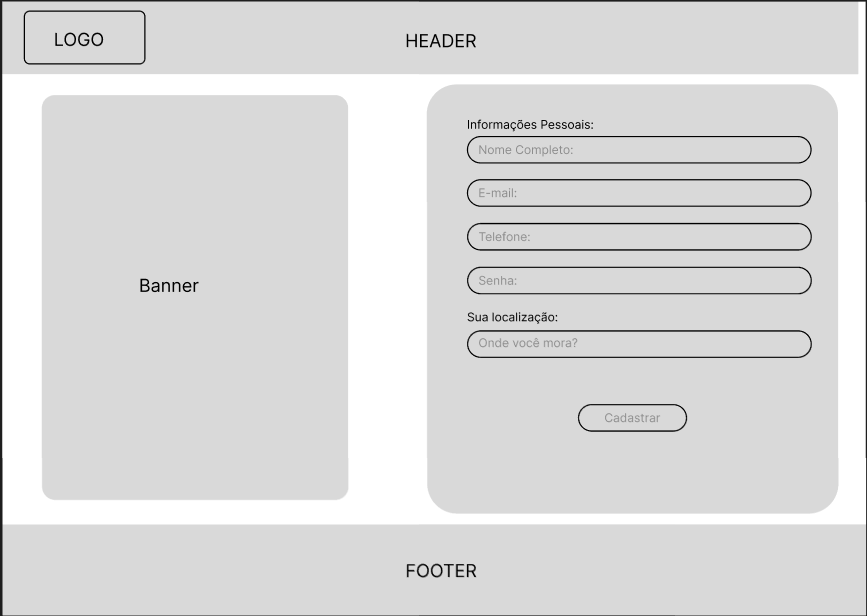

##### Service Provider Listing Screen
This screen allows users to view service providers and filter them based on the platform's criteria.

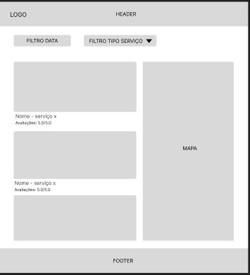

### User Flow

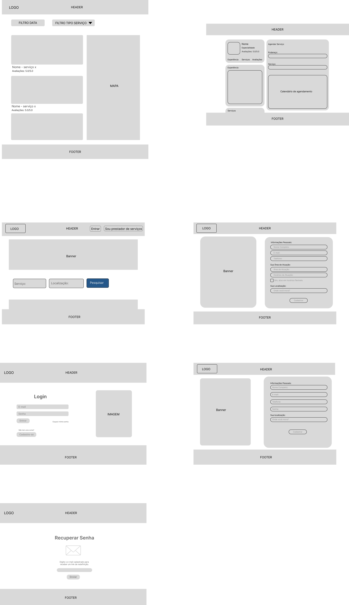

### Interactive Prototype

✅ [Interactive Prototype (MarvelApp)](https://marvelapp.com/prototype/34h4hae6/screen/97838948)

# Methodology

We initially used design thinking to model our problem. All team members met for one day of the week to dedicate most of the afternoon to modeling our problem and defining the next objectives, facilitating the development of the idea.

## Tools

List of tools used by the group throughout the project.

| Environment                    | Platform | Access Link                                     |
| --------------------------- | ---------- | -------------------------------------------------- |
| Design Thinking Process | Miro       | https://miro.com/app/board/uXjVKn8rbf4=/       |
| Code Repository     | GitHub     | https://github.com/ICEI-PUC-Minas-PPLCC-TI/ti1-g-prestadores-de-servico      |
| Interactive Prototype       | MarvelApp  | https://marvelapp.com/prototype/34h4hae6/screen/97838948    |
